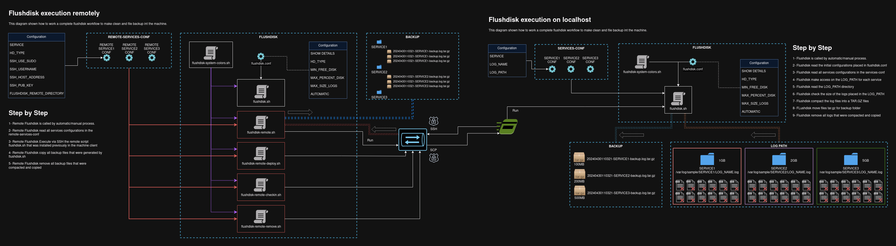
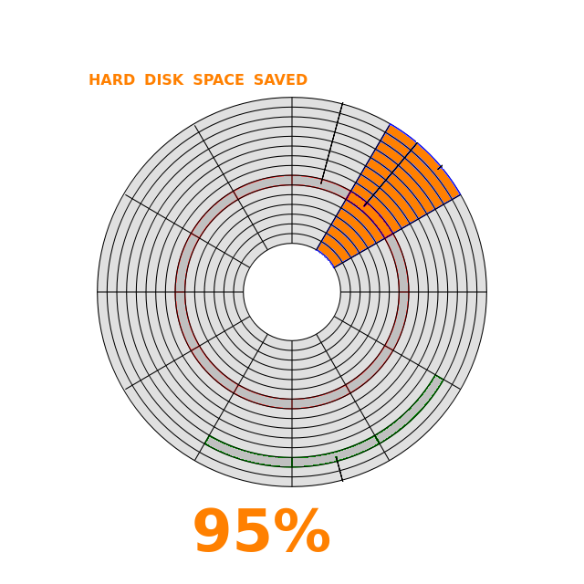
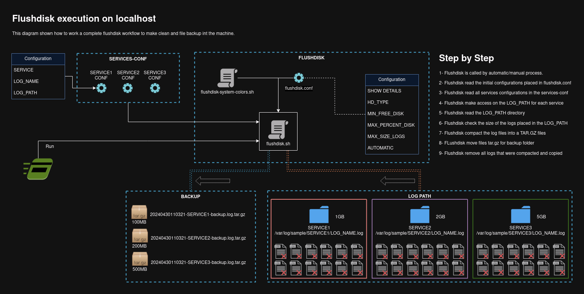
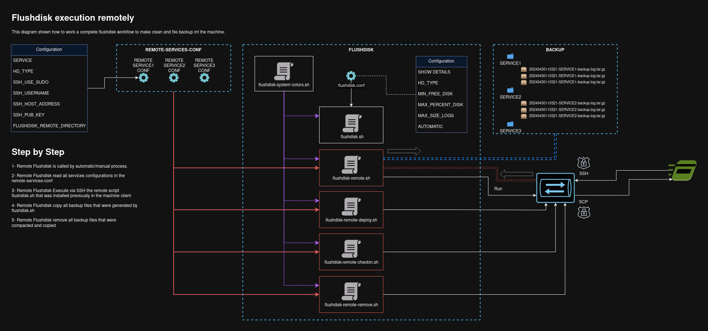
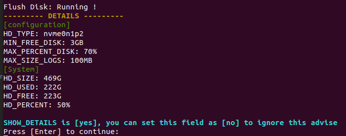
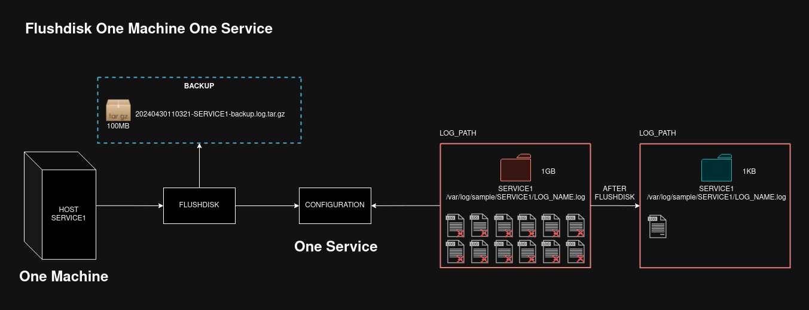
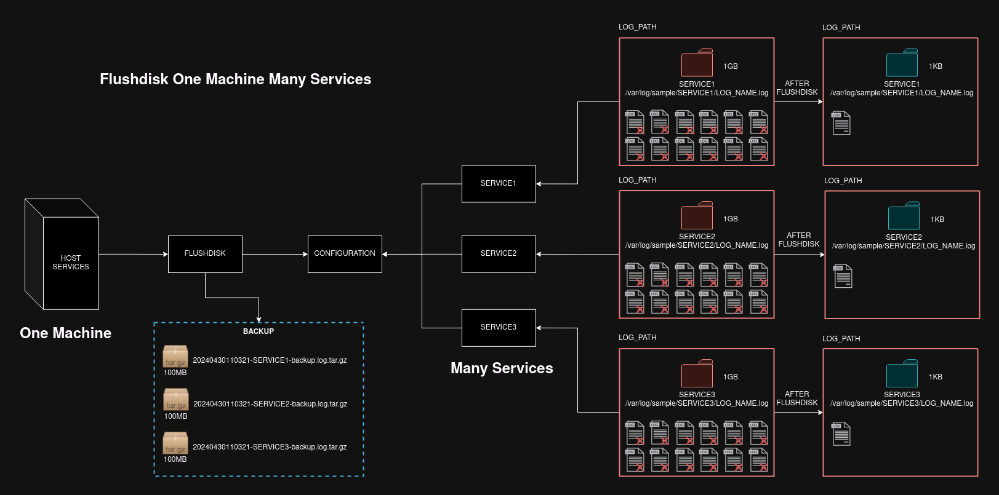
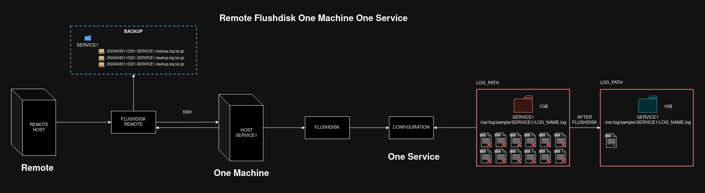
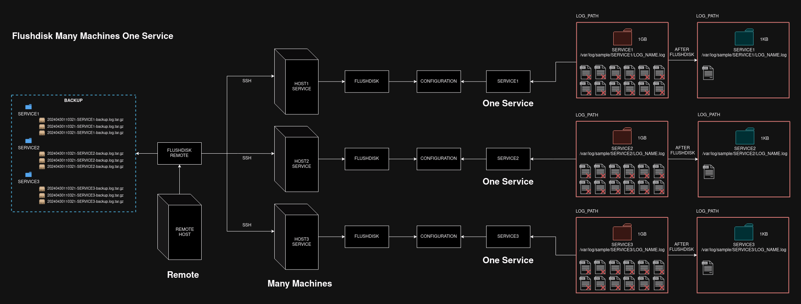
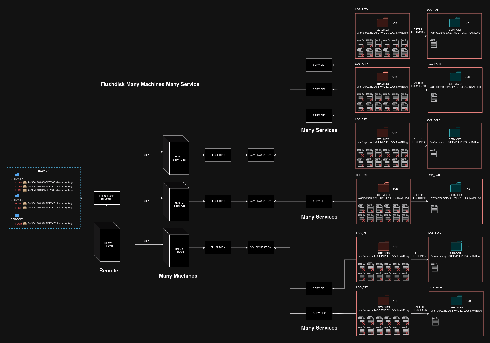

# Flushdisk
A small shell script project to help anyone on clean and save logs generated by backend services

# Requirements

- Operating System: Linux
- Secure Connection: SSH
- Public Key(optional): PEM, PPK, RSA
- Linux Commands: TAR
- Permissions (in some cases): SUDO

> It was tested in the Ubuntu 20.04, CentOS, Amazon Linux 2, Red Hat8 and Open Suse (Leap 15.5)

# About

Looking in the image above we can see a remote use and local use, that can be understandably easy to understand only 
reading the image content. We can see that the remote execution depends on local execution ate been installed and working 
correctly, so have a caution when you are install the flushdisk locally because the remote flushdisk will require it.

### Hard Disk Space saved

<table>
    <tr>
        <td>
            
        </td>
        <td>
            For exemplify how much is the gain of the disk space, let us calculate the percentage. Suppose that a log 
            path directory have a 112MB, and the flushdisk is configured for running in the 100MB, so it will be 
            running and compact the logs in a tar.gz file saving 95% of disk.
        </td>
    </tr>
    <tr>
        <td colspan="2">
            112MB - txt log files
             
            5MB - tar.gz log files (95% percent of saving disk space)
        </td>
    </tr>
</table>

### Super User - SUDO

In case there is any problem  when execute the flushdisk using a different user that owner log path, you can simply run 
the flushdisk using the "sudo" command to run as superuser system.

<pre>
sudo tar -czf ${FILE}.log.tar.gz *.log
</pre>

# How to work

- Locally

Like we can see in the image below, the local flushdisk execution is pretty simple. After the correct installation,
configuration and preparation from the services, the flushdisk will be make the following steps:

1. Import of the system colors from script flushdisk-system-colors.sh
2. Read global file configuration called flushdisk.conf
3. Read all services configuration files placed in the services-conf folder
4. Execute one by one of these services read previously to check, compact and finally clear the log path
5. The final step is copy the files compacted (tar.gz) into backup folder

- Remotely

In the remote execution we have the same scenario described above for the sub topic "Locally", but when we execute the 
remote flushdisk, the following steps will be coming together: 

1. Import the system colors from script flushdisk-system-colors.sh
2. Read all remote services configurations placed in the remote-services-conf
3. Execute one by one of these remote services in the local flushdisk execution (keep in your mind that the remote flushdisk are placed in the remote machine, and the flushdisk local/client/service are placed and running int the another machine)
4. Like described in the step 3, the remote flushdisk execute the flushdisk (local) via ssh 
5. After the complete execution from flushdisk (local/client/service) the compacted files (tar.gz) are copied for the remote flushdisk machine
6. Finally, the files compacted are saved in the folder backup separated by folder service name according the image below

> IMPORTANT: Look that there is a flushdisk.sh script in the path when we are using the remote flushdisk, and it can
> be made without problems, there is no trouble or conflict in todo that, it's perfectly possible. However, keep in your 
> mind that will be running remote and local instances of the flushdisk, and it can be little confusing to check the 
> backup logs in the backup folder path.

# Installing

It's possible run many services as possible that you want to, just create a file configuration for each one 
and is done, is pretty simple, is real fast, scalable and manageable.

- Local

To install the flushdisk in the local machine, and to run as a single instance, we can just clone the project from the 
GitHub account https://github.com/huntercodexs/flushdisk.git and set all configurations, according the instructions bellow.

### Clone Repository
<pre>
user@host:/home/user$ git clone https://github.com/huntercodexs/flushdisk.git .
user@host:/home/user$ cd flushdisk
</pre>

### Prepare the Flushdisk Configuration File
<pre>
# [true, false] - use [false] for automatically process
SHOW_DETAILS=true

# [sdb, sda, nvme, nvme0n1p1, nvme0n1p2, xvda]
HD_TYPE=nvme0n1p2

# GB (giga bytes)
MIN_FREE_DISK=3

# % (in percent)
MAX_PERCENT_DISK=70

# MB (mega bytes)
MAX_SIZE_LOGS=100

# [true, false]
AUTOMATIC=false
</pre>

### Prepare the Service Configuration File

> TIP: You can use the template file affordable in the folder called template/
 
<pre>
# SPECIFIC SERVICE NAME: [SERVICE_NAME, TOMCAT, ETC..]
# Warning: Don't use underscore character, use hyphen instead
SERVICE={SERVICE_NAME_HERE}

# LOG NAME - service_log_name
LOG_NAME={LOG_NAME_HERE}

# LOG PATH: /var/log/folder/service
LOG_PATH={LOG_PATH_HERE}
</pre>

### Set the CRONTAB Linux

This is a optional step, you can run the flushdisk manually whether you want to or needs, anyway follow one suggestion 
to configure and run the flushdisk using a crontab linux.

<pre>
## Crontab
##flushdisk: minute, hour, day, month, week_days, command
#0 6 * * * ${FLUSHDISK_PATH}/flushdisk.sh [all, SERVICE_NAME] [clear, check] [{0, 1}?] [FLUSHDISK_PATH] > /dev/null 2>&1
</pre>

Where:
<pre>
- ${FLUSHDISK_PATH} is the path where flushdisk is installed.
- [all, SERVICE_NAME] is a name for the service to cleaning the log path, "all" means every service and "SERVICE_NAME" a specific service.
- [clear, check] is the command to operate in the flush disk, "clear" is used to effectively apply the clean and "check" is used for only verify the health of log path and hard disk space.
- [{0, 1}] is an argument to say if flushdisk should be run in the FORCE mode or not
- [FLUSHDISK_PATH] this parameter is used only when the remote flushdisk is running - to overwrite a FLUSHDISK_PATH
</pre>

- Remote

If the environment requires a remote flushdisk manager, you can follow the steps below:

### Clone Repository
<pre>
user@host:/home/user$ git clone https://github.com/huntercodexs/flushdisk.git .
user@host:/home/user$ cd flushdisk
</pre>

### Prepare the Flushdisk Configuration File
<pre>
# [true, false] - use [false] for automatically process
SHOW_DETAILS=true

# [sdb, sda, nvme, nvme0n1p1, nvme0n1p2, xvda]
HD_TYPE=nvme0n1p2

# GB (giga bytes)
MIN_FREE_DISK=3

# % (in percent)
MAX_PERCENT_DISK=70

# MB (mega bytes)
MAX_SIZE_LOGS=100

# [true, false]
AUTOMATIC=false
</pre>

### Prepare the Service Configuration File

> TIP: You can use the template file affordable in the folder called template/

<pre>
# SPECIFIC SERVICE NAME: [SERVICE_NAME, TOMCAT, ETC..]
# Warning: Don't use underscore character, use hyphen instead
SERVICE={SERVICE_NAME_HERE}

# LOG NAME - service_log_name
LOG_NAME={LOG_NAME_HERE}

# LOG PATH: /var/log/folder/service
LOG_PATH={LOG_PATH_HERE}
</pre>

### Prepare the Remote Service Configuration File

> TIP: You can use the template file affordable in the folder called template/

<pre>
# service name
# Warning: Don't use underscore character, use hyphen instead
SERVICE={SERVICE_NAME_HERE}

# [sdb, sda, nvme, nvme0n1p1, nvme0n1p2, xvda]
HD_TYPE={HD_TYPE_HERE}

# false, true
SSH_USE_SUDO={SSH_USE_SUDO_HERE}

# username ssh
SSH_USERNAME={SSH_USERNAME_HERE}

# ssh ip target
SSH_HOST_ADDRESS={SSH_HOST_ADDRESS_HERE}

# ssh key
# examples: /home/user/ssh-key/keyname.pem, /home/user/ssh-key/keyname.ppk
# important: let empty if you are using the RSA public key
SSH_PUB_KEY={SSH_PUB_KEY_HERE}

# local path logs (remote)
FLUSHDISK_REMOTE_DIRECTORY={FLUSHDISK_REMOTE_DIRECTORY_HERE}
</pre>

### Deploy the flushdisk in the target remote machines

Use the script flushdisk-remote-deploy.sh to delivery the flushdisk and configurations for the target machines

<pre>
./flushdisk-remote-deploy.sh [all, {SERVICE_NAME}]
</pre>

Where:
<pre>
- [all, {SERVICE_NAME}] is a name for the service to cleaning the log path, "all" means every service and "SERVICE_NAME" a specific service.
</pre>

### Turn on the remote flushdisk

To turn on the remote flushdisk in the machine that will be access the remote flushdisk machines you can use the crontab 
linux according the example below (flushdisk-remote.sh):

<pre>
## Crontab
##flushdisk: minute, hour, day, month, week_days, command
##GMT(-03:00)
#0 9 * * * ${FLUSHDISK_PATH}/flushdisk-remote.sh [all,{SERVICE_NAME}] [clear, check] [{0,1}?] [{0,1}?] > /dev/null 2>&1
</pre>

Where:
<pre>
- ${FLUSHDISK_PATH} is the path where flushdisk is installed.
- [all, SERVICE_NAME] is a name for the service to cleaning the log path, "all" means every service and "SERVICE_NAME" a specific service.
- [clear, check] is the command to operate in the flush disk, "clear" is used to effectively apply the clean and "check" is used for only verify the health of log path and hard disk space.
- [{0, 1}] is an argument to say if flushdisk is running by automatic or manual process
- [{0, 1}] is an argument to say if flushdisk should be run in the FORCE mode or not
</pre>

### Extras

The remote flushdisk still offer others scripts to help management and handling of the flushdisk installation and logs,
like we can see below its possible to check the installation, remove an installation and deploy where the last one was 
already explained above.

<pre>
flushdisk-remote-checkin.sh
flushdisk-remote-remove.sh
flushdisk-remote-deploy.sh
</pre>

The flushdisk-remote-checkin.sh should be used to check if the installation was installed correctly. It checks the md5 
hash and integrity directory path where the flushdisk was installed in the remote machine.

To use it you need execute the following command:
<pre>
./flushdisk-remote-checkin.sh [all, {SERVICE_NAME}]
</pre>

The flushdisk-remote-remove.sh can be used to remove safely and totally one flushdisk installation, but pay attention 
the flushdisk don't remove the log files and also the configuration files.

> IMPORTANT: Don't forget to remove the flushdisk.sh and flushdisk-remote.sh from the linux crontab.

<pre>
./flushdisk-remote-remove.sh [all, {SERVICE_NAME}]
</pre>

# Configuration

### Flushdisk Config

In this topic we will learn how to configure the flushdisk.conf file placed in the flushdisk path folder. This file is 
used by flushdisk to get details about the system where it will be run to manger and clean the log path. Below we can 
see this file with a small comments about each field present in it.

###### SHOW_DETAILS
<pre>
# [true, false] - use [false] for automatically process
SHOW_DETAILS=true
</pre>

This field should be used to allow or not the details collected by flushdisk at the moment when it is running, and will 
be result in anything like the image below:

We can see all information about the current operating system with respect to the hardware in this case the hard disk, 
also the configuration about what we can apply in that machine. ***It's pretty simple !***

###### HD_TYPE
<pre>
# [sdb, sda, nvme, nvme0n1p1, nvme0n1p2, xvda]
HD_TYPE=nvme0n1p2
</pre>

In this field we say which type is the hard disk in the current machine and to discovery that information you can easily 
execute the following command

<pre>
df -h | grep -E '(Ava|nvme|xvda|sata|Usad|Used)'
</pre>

###### MIN_FREE_DISK
<pre>
# GB (giga bytes)
MIN_FREE_DISK=3
</pre>

This field means how space in gigabytes should be keeping in the current hard disk

###### MAX_PERCENT_DISK
<pre>
# % (in percent)
MAX_PERCENT_DISK=70
</pre>

This field means how space in percent should be keep in the current hard disk

###### MAX_SIZE_LOGS
<pre>
# MB (mega bytes)
MAX_SIZE_LOGS=100
</pre>

With this field we can control the log path in any service running in the current machine. In this case when you set up 
this field with a correct value in megabytes and execute the flushdisk with a FORCE mode (argument=1); the flushdisk 
will ignore the value in this field and execute the compact and clean in the log path folder.

###### AUTOMATIC
<pre>
# [true, false]
AUTOMATIC=false
</pre>

When used as true value in this field it means that the process execution should execute automatically without break or 
stops, by example the "read" command to get the system input data. Keep in mind that this field AUTOMATIC=true is 
required when flushdisk is running via linux crontab or another automatic jog runner. 

### Services Config

###### SERVICE
<pre>
# SPECIFIC SERVICE NAME: [SERVICE_NAME, TOMCAT, ETC..]
# Warning: Don't use underscore character, use hyphen instead
SERVICE={SERVICE_NAME_HERE}
</pre>

This field  specify the service name that refer to this configuration

###### LOG_NAME
<pre>
# LOG NAME - service_log_name
LOG_NAME={LOG_NAME_HERE}
</pre>

The name of the log name that will be managed by flushdisk and will generate by the current target service

###### LOG_PATH
<pre>
# LOG PATH: /var/log/folder/service
LOG_PATH={LOG_PATH_HERE}
</pre>

This field is used to say where is the log files of the current service

### Remote Flushdisk Services Config

###### SERVICE
<pre>
# service name
# Warning: Don't use underscore character, use hyphen instead
SERVICE={SERVICE_NAME_HERE}
</pre>

###### HD_TYPE
<pre>
# [sdb, sda, nvme, nvme0n1p1, nvme0n1p2, xvda]
HD_TYPE={HD_TYPE_HERE}
</pre>

This field  specify the service name that refer to this configuration

###### SSH_USE_SUDO
<pre>
# false, true
SSH_USE_SUDO={SSH_USE_SUDO_HERE}
</pre>

This field means if it should be used "sudo" or not in the ssh connection, pay attention with this setting because it 
can be exposing the service or environment to invasion or another types of secure fail issues.

###### SSH_USERNAME
<pre>
# username ssh
SSH_USERNAME={SSH_USERNAME_HERE}
</pre>

Use this field to set ssh username which will be used to connect in the remote machine where flushdisk is running

###### SSH_HOST_ADDRESS
<pre>
# ssh ip target
SSH_HOST_ADDRESS={SSH_HOST_ADDRESS_HERE}
</pre>

This field inform the IP or hostname address where the remote flushdisk should be to connect via ssh connection.

###### SSH_PUB_KEY
<pre>
# ssh key
# examples: /home/user/ssh-key/keyname.pem, /home/user/ssh-key/keyname.ppk
# important: let empty if you are using the RSA public key
SSH_PUB_KEY={SSH_PUB_KEY_HERE}
</pre>

Here is the most one important field, with it, you say that the remote flushdisk must use a public key ssh like the RSA key 
or another key like PEM or PPK. Normally when we run the ssh connection it is not necessary, but in the environment with 
a strong secure and an infrastructure closed, it can be easily required, by example:

<pre>
ssh -i /home/user/key/my-key.pem user@address:/home/user
sudo ssh -i /home/user/key/my-key.pem user@address:/home/user
</pre>

###### FLUSHDISK_REMOTE_DIRECTORY
<pre>
# local path logs (remote)
FLUSHDISK_REMOTE_DIRECTORY={FLUSHDISK_REMOTE_DIRECTORY_HERE}
</pre>

When the remote flushdisk is running this field have a correct path to flushdisk execute the clean and compact, it will 
be used by argument 4 (FLUSHDISK_PATH_REMOTE) in the flushdisk.sh execution, by example:

<pre>
./flushdisk.sh all clear 1 /home/user/codexstools/flushdisk
</pre>

The parameter 4 (/home/user/codexstools/flushdisk) says that the current remote flushdisk is installed in this path 
and the flushdisk path will be replaced it, explaining:

<pre>
flushdisk.sh is running -> FLUSHDISK_PATH=/home/user
flushdisk.sh is running -> FLUSHDISK_PATH_REMOTE=/home/user/codexstools/flushdisk
flushdisk.sh is running -> FLUSHDISK_PATH=FLUSHDISK_PATH_REMOTE
</pre>

In the explanation above the path that will be to consider by flushdisk is /home/user/codexstools/flushdisk

# Use Cases

###### Use Case: Flushdisk 1:1 (One Machine for One Service)

The use case above show us how to work the flushdisk in a simple situation, one machine for one service

###### Use Case: Flushdisk 1:N (One Machine for Many Services)

When we have a situation with a bit more complex case, with many services running in the same machine

###### Use Case: Remote Flushdisk 1:1 (One Machine for One Service) 
 
The remote flushdisk using a flushdisk 1:1

###### Use Case: Remote Flushdisk 1:N

The remote flushdisk using a flushdisk 1:N

###### Use Case: Remote Flushdisk N:1 (Many Machines for One Service)

The remote flushdisk using a flushdisk N:1

###### Use Case: Remote Flushdisk N:N (Many Machine for Many Services)

The remote flushdisk using a flushdisk N:N

