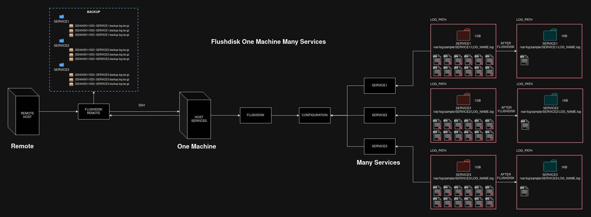

# Flushdisk
A small shell script project to help anyone to clean and save logs

# Overview

# About

The Flushdisk is a small project wrote in shell script language to offer a complete and stabled log manager system and 
help you to keep the log path clean and save hard disk space.

# How to work

- Locally

- Remotely

# Use Cases

- Use Case: Flushdisk 1:1 (One Machine for One Service)

- Use Case: Flushdisk 1:N (One Machine for Many Services)

- Use Case: Remote Flushdisk 1:1 (One Machine for One Service) 

- Use Case: Remote Flushdisk 1:N

- Use Case: Remote Flushdisk N:1 (Many Machines for One Service)

- Use Case: Remote Flushdisk N:N (Many Machine for Many Services)